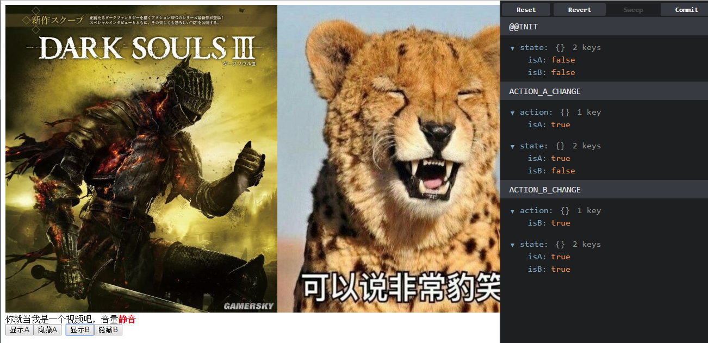

# 一个使用React+Redux写的小例子




为了公司内部培训写的一个小例子，分享出来，方便新手了解React+Redux的开发流程。

内容很简单：两个界面A和B，界面显示，就将视频静音，界面消失，就恢复声音，同时要考虑两者同时显示的情况。

react+redux的实现非常简洁，逻辑清晰。

大家可以考虑传统方案实现与使用react+redux实现的区别，如果界面增加到四个、五个会是什么情况？

## 使用方法

```
npm install

npm run dev
```

打开chrome浏览器，访问[http://localhost:8001/](http://localhost:8001/)

